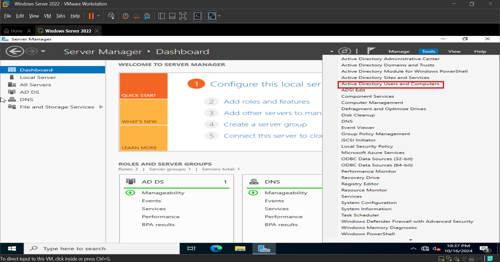

# Introduction  

In this phase, I will install and configure Active Directory Domain Services (AD DS), transforming the Windows Server into a Domain Controller. AD DS allows centralized management of users, computers, and resources within the network. This setup will also include configuring DNS and creating the foundation for managing user accounts, organizational units, and security policies within the domain environment.

## Phase 3 : Installing and Configuring Active Directory (AD DS)  

### Step 1: Rename the Server:  

1. Open Server Manager → Local Server.  
2. Next to Computer Name, click the current server name.  

3. Click on Change --> Enter the new server name (DC1) and then click OK.  
4. Restart the server.  

  

### Step 2: Install Active Directory Domain Services (AD DS)  

1. Open Server Manager and click Manage → Add Roles and Features.  

2. In the Add Roles and Features Wizard:  

- Choose Role-based or feature-based installation.  

  

- Select your current server from the list.  

  

- Check Active Directory Domain Services (AD DS).  

- A pop-up will ask to add required features. Click Add Features.  

 

- Click Next 3 times and then Install.  

 

### Step 3: Promote the Server to a Domain Controller  

1. After AD DS is installed, return to Server Manager.  

2. Click the yellow notification flag and select Promote this server to a domain controller.  

 

3. In the Deployment Configuration wizard:  

- Select Add a new forest.
- Enter the Root Domain Name (tekfix.com).  

 

4. In Domain Controller Options:  

- Leave DNS and Global Catalog selected.  
- Set a Directory Services Restore Mode (DSRM) password.  

5. Complete the wizard, review your settings, and click Install. The server will reboot.  

 

### Step 4: Verify Active Directory Installation  

1. After the server reboots, log in again.  

2. Open Server Manager → Tools → Active Directory Users and Computers.  

 

3. Verify your domain (Tekfix.com) is listed and that the server is now a Domain Controller.  

 

### Step 5: Configure DNS  

1. Open Server Manager → Tools → DNS.  

 

2. Expand next to your server name (DC1) and Verify that a Forward Lookup Zone has been created for the domain (Tekfix.com).  

 

3. Test DNS resolution by using nslookup on the server and client machines to ensure they resolve the domain correctly:  

- Open cmd on the server.  
- Type nslookup tekfix.com  (replace tekfix.com with your domain)  

 

We can see that the DNS resolution for my domain tekfix.com is successfully pointing to the internal IP address 192.168.66.100, which is the IP address of my Domain Controller.  

This confirms that the DNS configuration is working correctly for my Active Directory (AD) domain.  

### Summary

In this phase, I have successfully installed and configured Active Directory Domain Services (AD DS) and promoted my server to a Domain Controller. DNS is now configured to work alongside AD, ensuring proper name resolution within the domain. I am now ready to proceed to the next phase, where I will configure Organizational Units (OUs), manage users, and set up Group Policies.

Click on [Group Policy Management](./Group_Policy_Management.md) to move to next phase.

