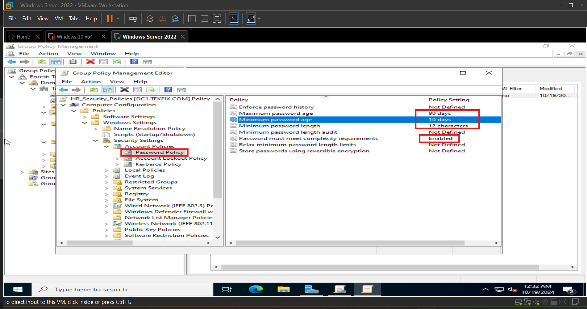
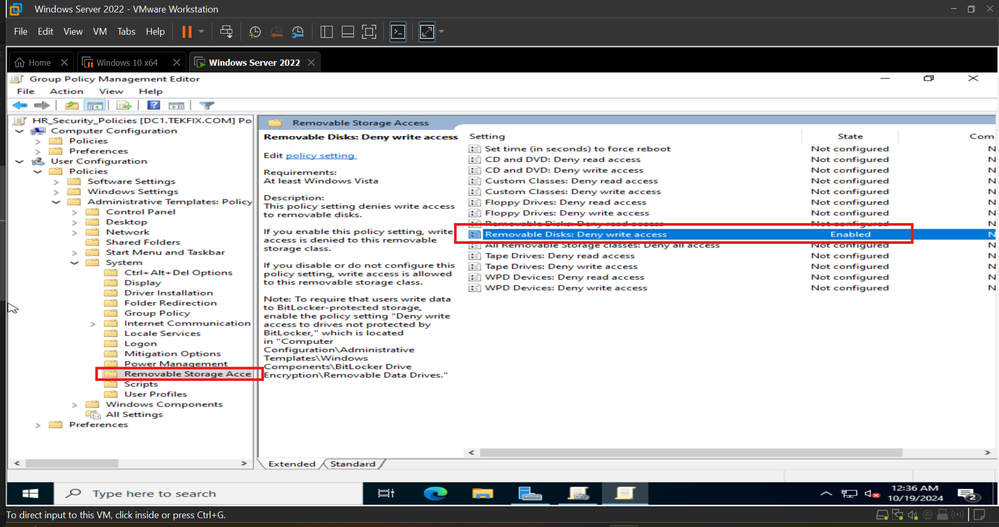
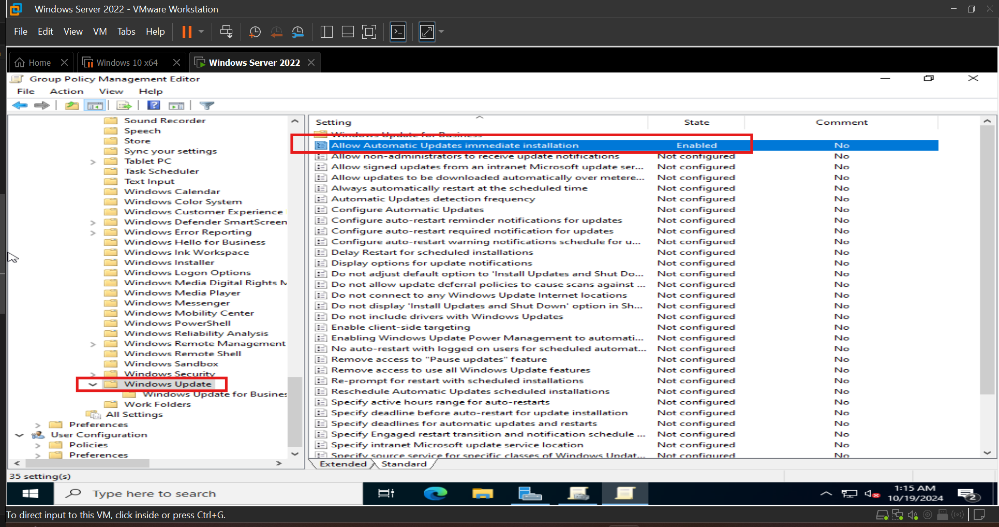
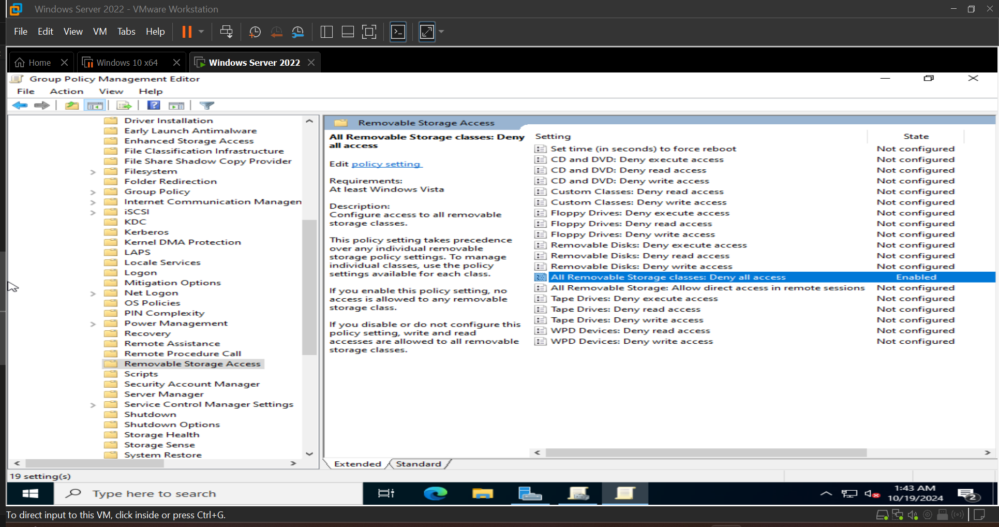
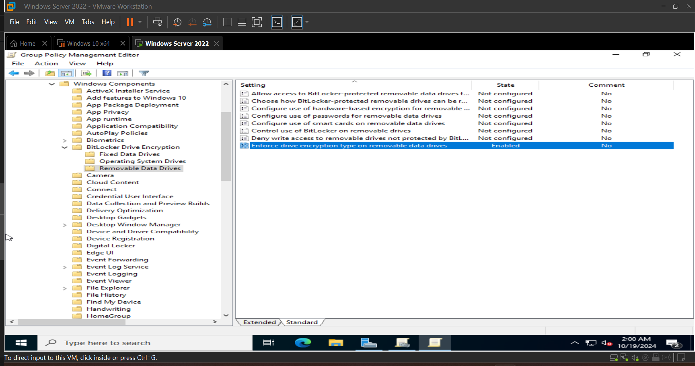
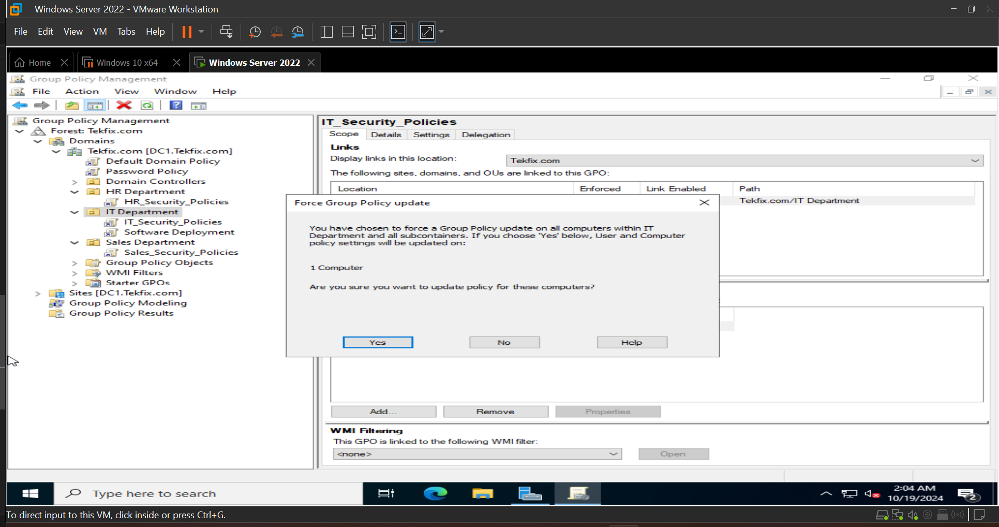

## Phase 6: Department-Specific Security Policies Implementation  

In this phase, we focus on creating tailored security policies for each department: IT, HR, and Sales. This is crucial for ensuring that each department adheres to security practices suited to its role in the organization. By leveraging Group Policy Objects (GPOs), we will configure policies to manage software access, permissions, and security measures specific to each department. These tailored configurations will enhance security and operational efficiency while addressing the unique needs of every department.  

As Henry Ford once said, "Coming together is a beginning, staying together is progress, and working together is success." This phase will build on the collaborative foundation of previous steps while looking forward to the final security refinements.  

### Step 1: Define Security Requirements for Each Department  

- IT Department: Tighten access to administrative tools, enforce stricter password policies, and limit software installations.  

- HR Department: Focus on securing sensitive data such as employee records, and enforce encryption policies.  

- Sales Department: Implement policies that safeguard client data and control external access.  

### Step 2: Create New GPOs for Each Department  

1. Open the Group Policy Management tool on your server.  

2. Right-click on the specific department's OU (Organizational Unit), then choose Create a GPO in this domain, and Link it here.  

3. Name the GPO appropriately, for example, "IT_Security_Policies", "HR_Security_Policies", and "Sales_Security_Policies."  

  

### Step 3: Configure Security Policies  

For each department's GPO, follow these steps:  

1. Right-click the GPO → Select Edit to open the Group Policy Editor.  

2. Navigate to Computer Configuration or User Configuration based on the policies you want to enforce (e.g., password policies, software restrictions):  

  - ##### HR Department  

    1. Password Policy:  
    
      - Navigate to Computer Configuration → Windows Settings → Security Settings → Account Policies → Password Policy.  
      
      - Enforce password complexity, maximum & minimum password age and set a minimum password length.  

        

    1. Data Access Restrictions:  
    
      - Under User Configuration → Policies → Administrative Templates → System → Removable Storage Access.   
      
      - deny write access to removable drives to prevent data leaks.  

        

  - ##### IT Department Security Policy Documentation        

    1. Patch Management :  

      - Go to Computer Configuration > Administrative Templates > Windows Update.  

      - Set automatic updates for patching IT infrastructure.  

        

    2. Audit Trails :  

      - Navigate to Computer Configuration > Policies > Windows Settings > Security Settings > Advanced Audit Policy Configuration.  

      - Enable auditing for privilege use, and System Integrity.  

        

        

  - ##### Sales Department  

    1.  Limit External Access:  
    
      - Under Computer Configuration → Policies → Administrative Templates → System → Removable Storage Access.    
      
      - Deny all access to all removable storage classes.    

      

    2. Data Encryption:  
    
      - Set Computer Configuration → Windows Settings → Security Settings → BitLocker Drive Encryption → Removable Data Drives.  
      
      - Enable Enforce drive encryption type on removable data drives.  

      

### Step 4: Link and Apply the GPOs  

1. Ensure that each GPO is linked to the appropriate OU containing the computers or users for that department.  

2. Right-Click each OU > Click Group Policy Update.  

  

### Step 5: Test Security Policies  

1. Verify Settings: Log in to a client machine in each department and check that the policies (e.g., file access, password complexity) are applied.  

2. Confirm Restrictions: Attempt actions that should be blocked by the policies (e.g., installing unauthorized software or accessing encrypted files) to verify enforcement.  

### Summary  

During this phase, we successfully implemented and tested security policies for each department: HR, IT, and Sales. This included setting up specific security configurations like software restrictions, encryption policies, and administrative account limitations. After enforcing these policies, thorough testing ensured that all security settings were applied correctly and were functioning as intended.  

Now that the security policies are in place, we will proceed with Phase 6: Helpdesk Ticketing System Setup, where we will configure a support system for the IT team to manage requests efficiently.  

Click on [Helpdesk Ticketing System Setup](./Helpdesk_Ticketing_System_Setup.md) to move to next phase.  

