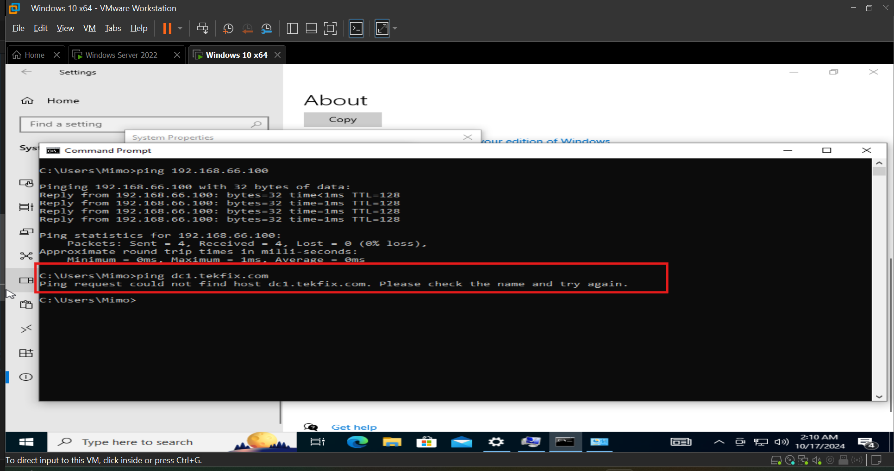
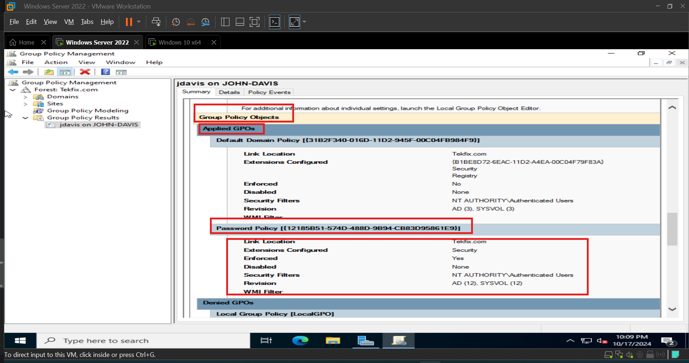

## Phase 4: Creating OUs, Users, and Group Policies  

In this phase, I will structure my Active Directory (AD) by creating Organizational Units (OUs) for logical management, setting up user accounts, and configuring Group Policies to manage user and computer settings.  

### Step 1: Create Organizational Units (OUs)  

1. Open Active Directory Users and Computers (ADUC) from Server Manager → Tools.  

  

2. In the left pane, right-click on the domain name (tekfix.com) → New → Organizational Unit.  

3. Name the OU (IT Department, HR Department, Sales Department). I am doing it on this project manually. When I redo this project using Non GUI windows server version, I will be using powershell scripts to do this.  

4. Repeat this to create separate OUs for different departments or user groups.  

  

### Step 2: Create User Accounts  

I will be creating 2 users for each department.

1. In ADUC, right-click on the OU you created (IT Department) → New → User.  

2. Fill in the user details (First Name, Last Name, and User Logon Name).  

3. Set a password for the user.  

4. Choose whether the user must change the password at the next login.  

  

### Step 3: Set Up Group Policies (GPOs)  

1. Open Group Policy Management from Server Manager → Tools.  

  

2. Right-click your domain or an OU → Create a GPO in this domain, and link it here.  

  

3. Name the GPO (Password Policy).  

4. Right-click the GPO (Password Policy) → Edit to define specific settings.  

  

5. Navigate to Computer Configuration → Policies → Windows Settings → Security Settings → Account Policies → Password Policy.  

  

6. I set Maximum password age to 60 days, minimum password age to 1 day, Minimum password length to 8 characters, and enabled password complexity.  

  

5. Close the editor and ensure the GPO is linked to the correct OU or domain.  

- Linked the policy to the domain so it will be inherited by everyone in the domain. 

  

 

### Step 4: Connect client machine to the domain:  

We will connect the Windows 10 VM we created on the first phase to the domain we created.  

1. Log in to the client machine as a local administrator.  

2. Open Settings → System → About → Rename this PC (Advanced).  

  

3. Click Change under Computer Name.  

4. Select Domain, then enter domain name (tekfix.com). Rename the computer as well if you want.  

  

5. Getting error that AD DC for the domain cant be contacted.  

  

6. The error message indicates that the client machine cannot contact the Domain Controller for tekfix.com. Here are steps to troubleshoot:  

- Verify Network Connectivity by Ensuring the client can ping the Domain Controller IP address (ping 192.168.66.100).  

  

- Pinging is successfull. Now ping to the controler domain name (DC1.tekfix.com).  

  

- Since the client was able to ping to the controler Ip (192.168.66.100) but not to the controller domain name (dc1.tekfix.com), then it is a DNS problem.  

- I will change the primary DNS of the client to the DC IP (192.168.66.100) and that should solve the name resolution problem we are having.  

  

- Now that we changed the primary DNS, lets try to ping dc1.tekfix.com.  

  

- ping dc1.tekfix.com was successfull. Now lets go back and connect our client to the domain. bullet point 4 of step 4.  

7. Select Domain, then enter domain name (tekfix.com). Rename the computer as well if you want.  

  

8. Provide domain admin credentials when prompted.  

  

  

9. We have successfully joined the Domain. Restart the client machine to complete the process.  

10. After reboot, the client will be part of the domain, and you can log in using domain credentials.  

  
  
  

The client machine has successfully joined the tekfix.com domain, and the connection to the Domain Controller is verified, allowing domain user logins and access to domain resources. I have created 6 users, 2 of each department (IT, Sales, HR). I will log in to windows 10 VM's with each user and make sure all are connected just same as we did above. So we can test different policies we wll create later in this phase.   

### Step 5: Group Policy Application (Password Policy) Verification: 

We will use 2 verification methods. 1st method on the client, trying to change the password and use a password that outside of the password policy settings we set, and the second method using gpresult wizard on the server under GPO for the client computer.

#### Method 1: Client side verification:  

1. On the client computer press "Ctrl + Alt + Delete"  → Change Password.   

  

2. verify that the password must comply with the policy (e.g., complexity, length).  

  

This confirms that the password policy is being enforced.  

#### Method 2: GPResult Wizard from Server side:  

1. Open Server Manager -> Tools -> Group Policy Management.  

2. Right Click the Group Policy Results on the left Pane -> Click Group Policy Results Wizard.  

  

3. Click Next -> Check Another computer -> Click Browse -> Type your user name (John) -> Click Check Name -> Click OK.  

  

4. Click Next 3 times then Click Finish.  

5. Group Policy Results Report will generate on the left side. Review the results to confirm that the password policy GPO is listed under Applied Group Policy Objects.  

  

This confirms that the password policy is being enforced and applied.  

**We can turn the firewall back on.**

## Summary  

In this phase, we successfully created Organizational Units (OUs) for logical management, added user accounts for each department, and implemented Group Policy Objects (GPOs) to enforce password policies and other security settings. These steps establish centralized control over users and computers, enhancing network management and security within the domain. The environment is now ready for further configuration, including software deployment and network management.  

Click on [Software Deployment via Group Policy](./Software_Deployment_via_Group_Policy.md) to move to next phase.  