## Phase 7: Helpdesk Ticketing System Setup  

This phase will involve configuring a helpdesk ticketing system to streamline IT support requests within the organization. We will set up a system where users can submit issues, track progress, and receive updates from the IT department. The system will also allow IT staff to prioritize, assign, and resolve tickets efficiently. We'll implement the osTicket helpdesk system for managing IT support tickets efficiently.  

### Step 1: Download osTicket:  

  - Go to [osTicket](https://osticket.com/download/) and download the latest Version.  

  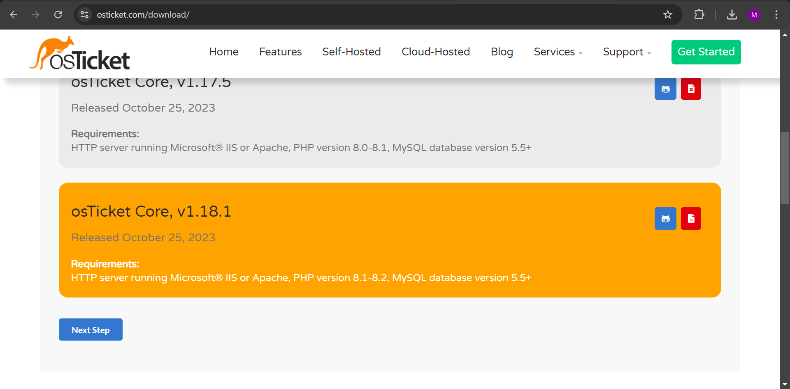  

### Step 2: Server Requirements:  

  - Ensure your server supports:  
    - Web server (Apache or IIS)  
    - PHP (v8.0 to 8.2)  
    - MySQL Database  

### Step 3: Download:     

  1. Go to [XAMPP Installers and Downloads](https://www.apachefriends.org/) and download it.  

  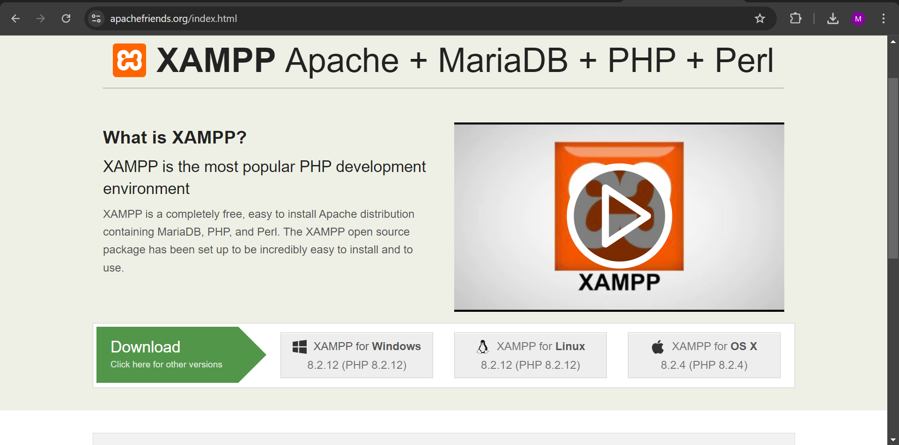  

  XAMPP is a free and open-source cross-platform web server package that includes Apache, MySQL, PHP, and Perl, making it easy to create and manage a local server for web development.  

### Step 4: Install Web Server:  

  1. Install XAMPP.  

  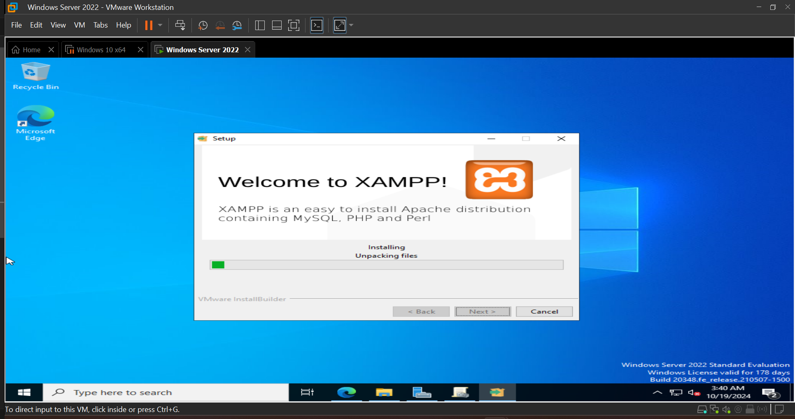  

  2. check "Do you want to start the control Panel now?" and click Finish.  

  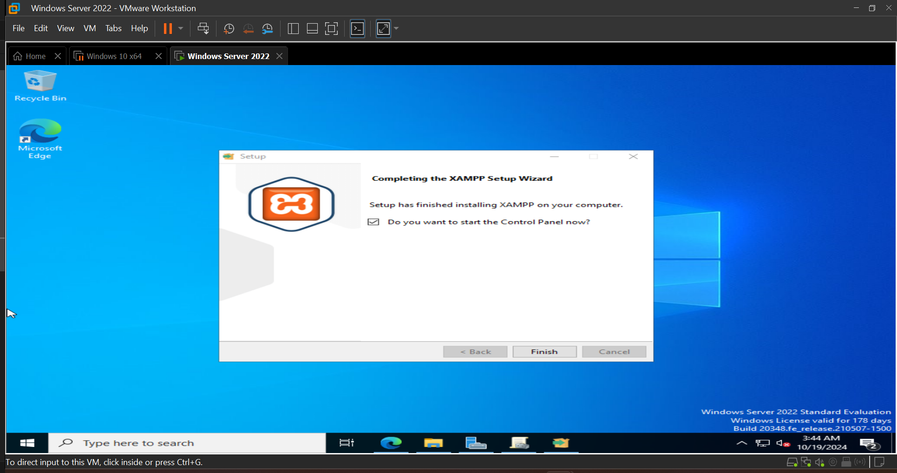  

  3. Start Apache and MySQL.  

  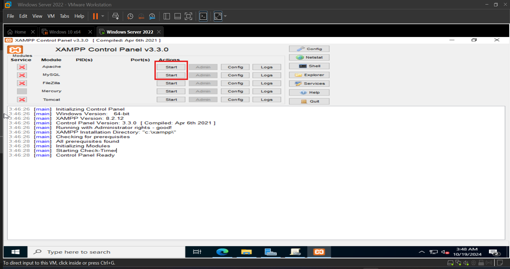  
  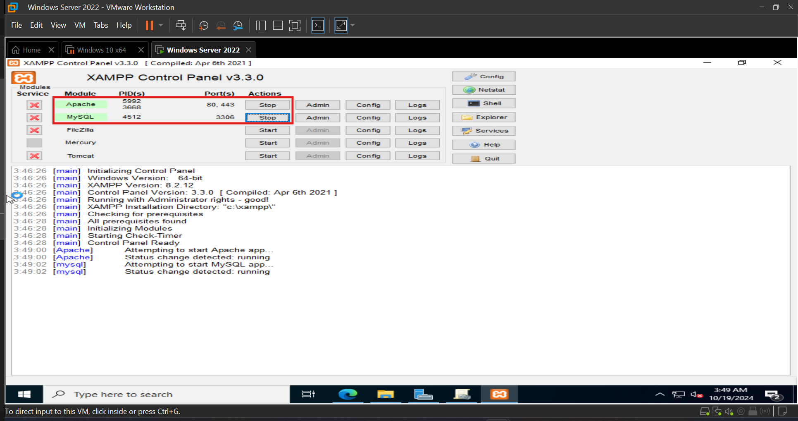  

### Step 5: Extract osTicket:  

  1. Go to C:\xampp\htdocs, create a folder and name it osticket.  

  2. Extract the osTicket ZIP file you downloaded earlier into osticket folder you just created.  

  3. Within osticket folder after you extract osticket zip file, extract the other zip file named "osticket-vx.xx.x".  

  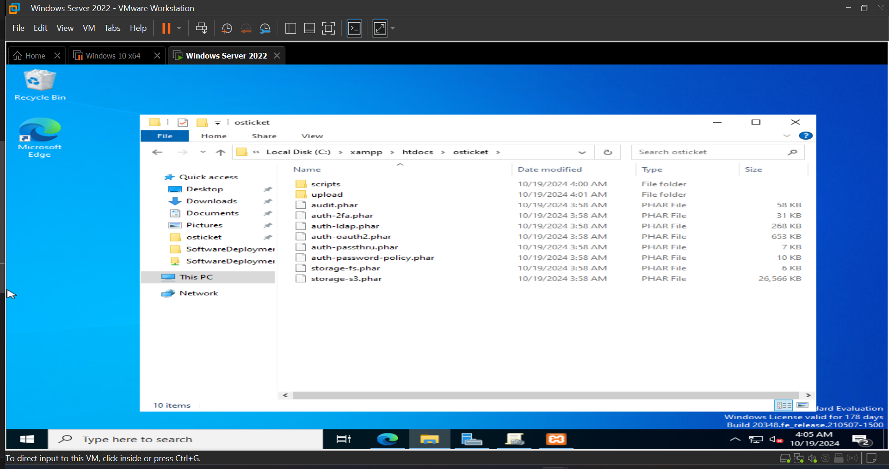  

### Step 6: Database Setup:  

  1. Open a browser and go to http://localhost/phpmyadmin.  

  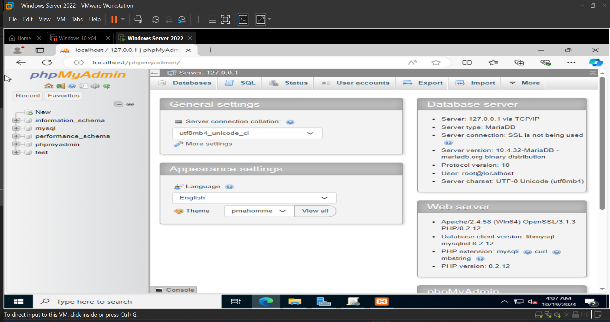  

  2. Click on SQL Tab and type the following to create a database then click on Go:  

      CREATE DATABASE osticket_db;  
      CREATE USER 'osticket_user'@'localhost' IDENTIFIED BY 'password';  
      GRANT ALL PRIVILEGES ON osticket_db.* TO 'osticket_user';  
      FLUSH PRIVILEGES;  

  The SQL script above is used to create a new database for the osTicket installation where we named the database osticket_db.  
  We created osticket_user as the user. Replace 'password' with your own chosen password.  

  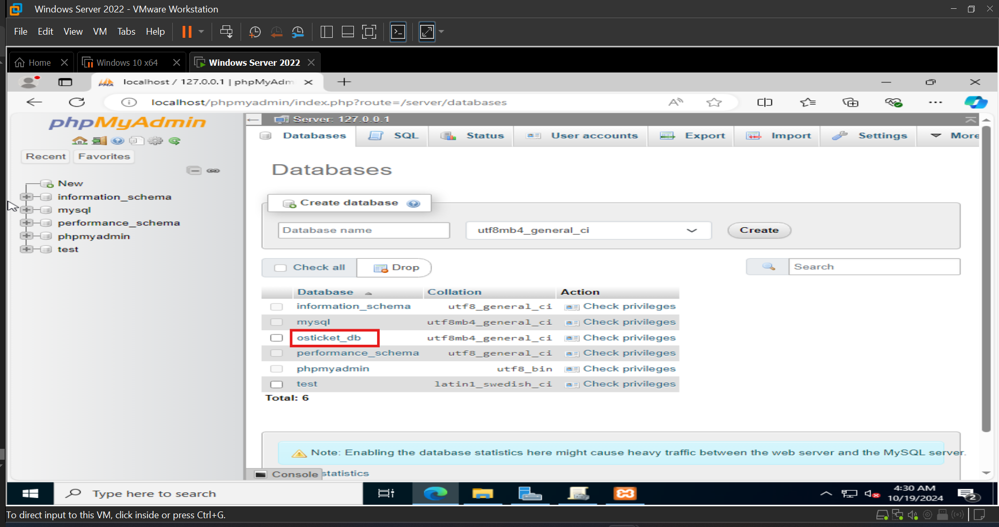  

### Step 7: osTicket Installation:  

  1. Open http://localhost/osticket/upload/setup/install.php in your browser. You’ll be guided through the installation process.  

  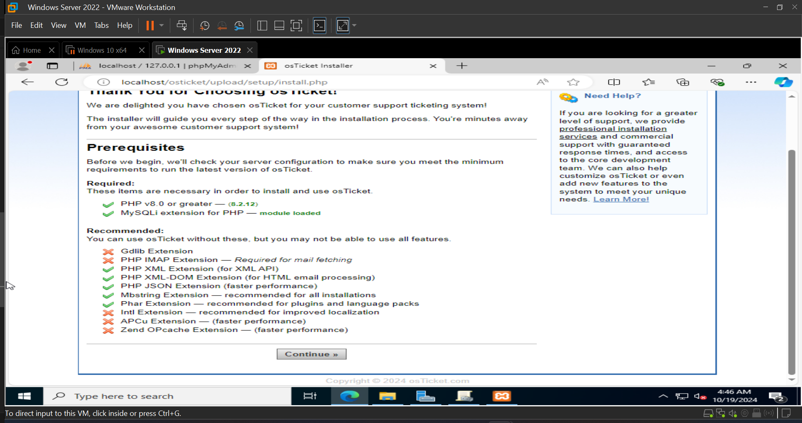  

  2.  Rename the htdocs\osticket\upload\include\ost-sampleconfig.php to ost-config.php.  

  3. System Settings:  

    - Choose the helpdesk name. (Name it whatever you want).  
    - Default Email.  
    
  4. Admin User:  

    - Type in your first name, last name and your email address if you are the admin user.  
    - Create a username and password.  

  5. Database Settings:  

    - Enter the MySQL Database we created earlier. (osticket_db).  
    - MySQL Username. (osticket_user).  
    - MySQL Password. The password we created for the database earlier.  

  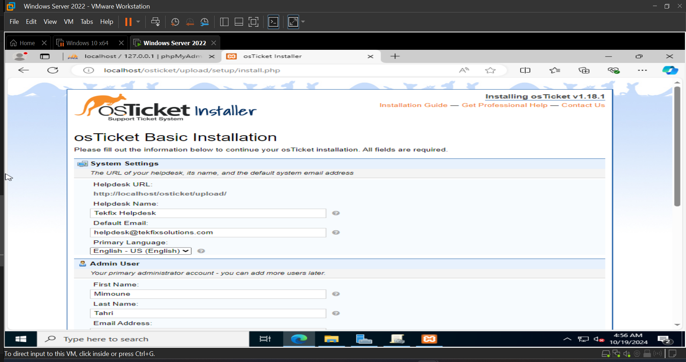  
  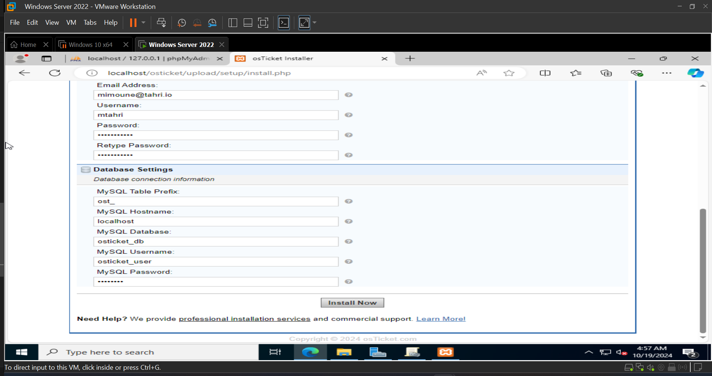  

  6. Click 'Install Now'.  

  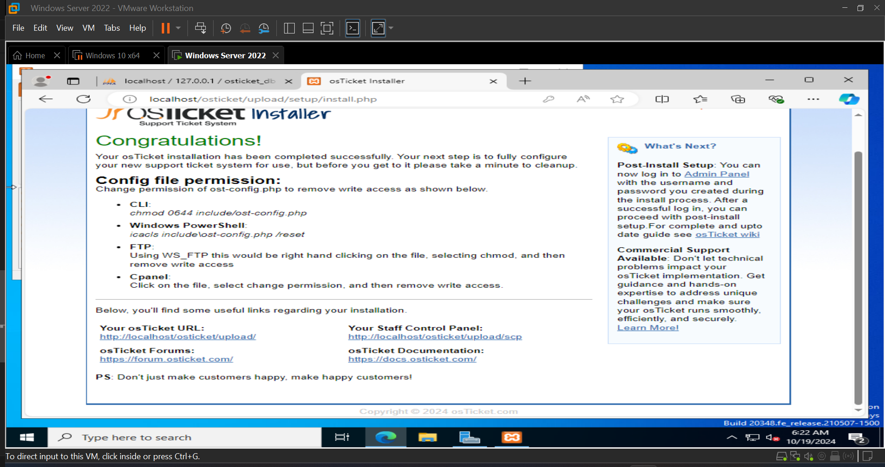  

  7. Open Powershell > type cd "C:\Xampp\htdocs\osticket\upload" and press Enter.  

  8. Type icacls include\ost-config.php /reset and press Enter.  

  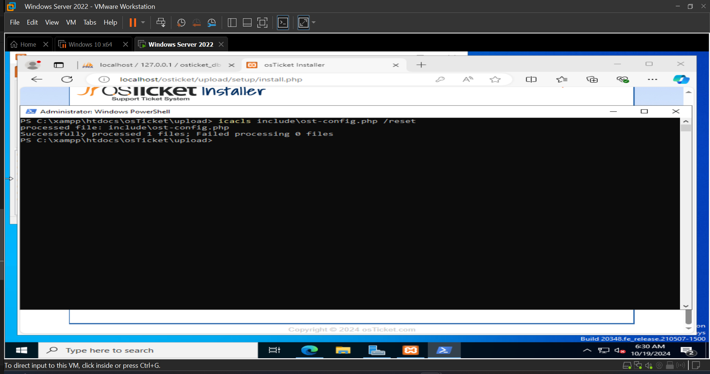  

  9. To remove the setup folder for security, type Remove-Item -Recurse -Force .\setup\ .  

  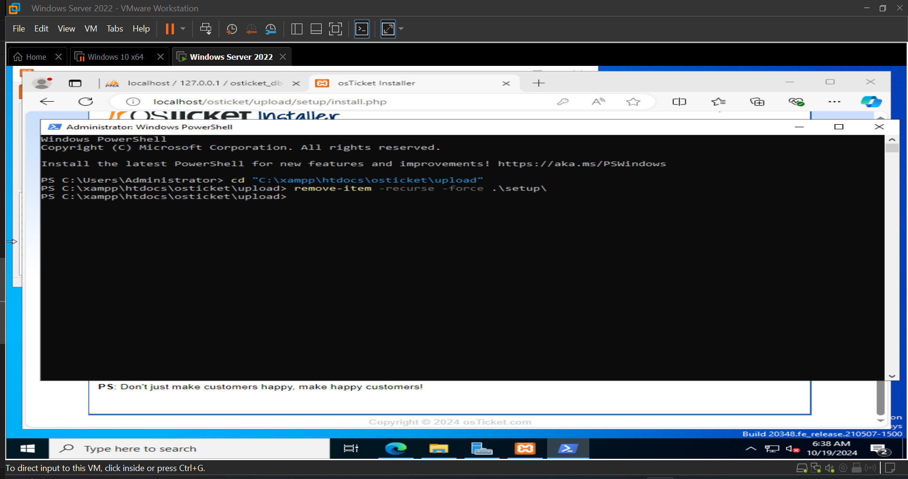  

### Step 8: osTicket Configuration:  

  1. Login to Admin Panel:  

    - After installation, log in to the osTicket admin panel using the admin credentials you just created.  

    - Admin Panel URL: http://localhost/osticket/scp.  

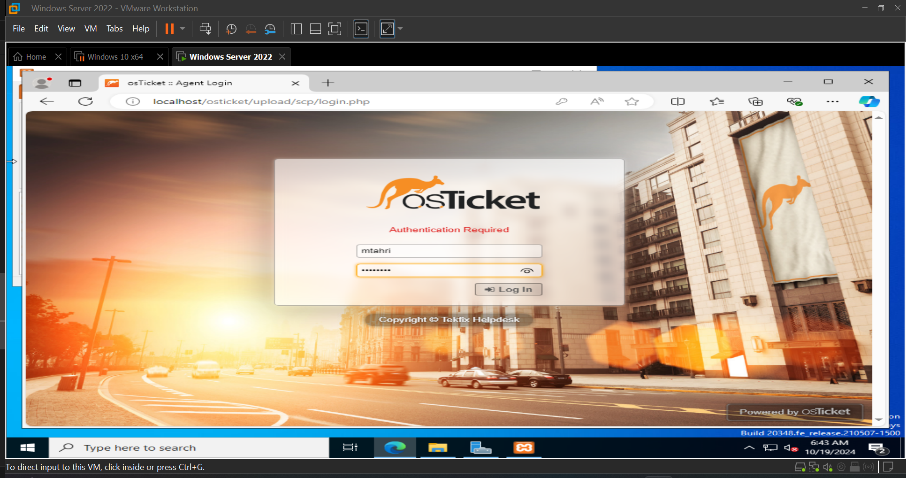  

  3. Post-Installation Configuration:  

    - Email Setup: Go to Admin Panel > Settings > Emails and configure the email settings. This allows 
    osTicket to send and receive tickets via email.  

    - Departments and Help Topics: Create departments and help topics under Agents > Departments and 
    Manage > Help Topics.  

    - Ticket Assignment: Set up automatic ticket assignment rules under Admin Panel > Settings > Tickets.  

  4. User Roles and Permissions:  

    - Define roles for your agents, set permissions, and assign users to different roles under Agents > Roles.  

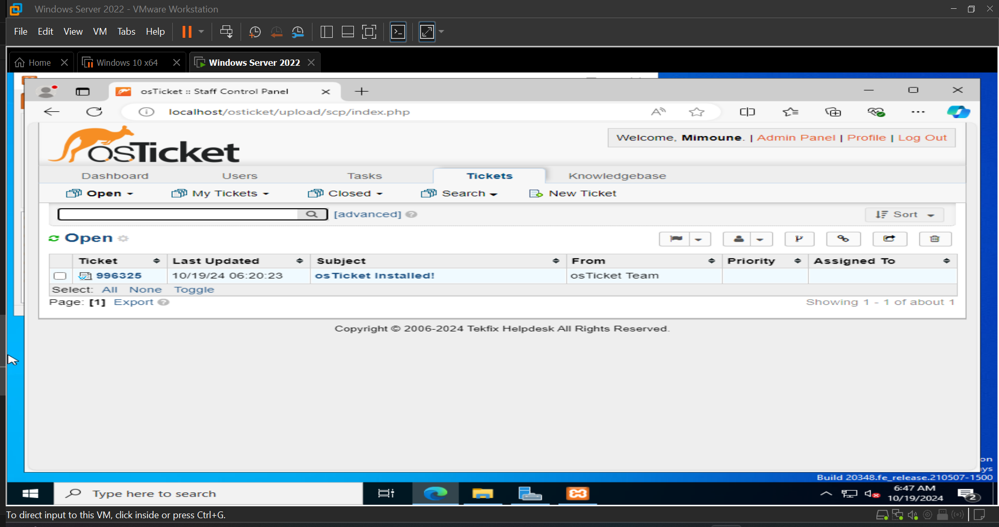  

    Once these initial configurations are complete, you can begin testing osTicket by creating tickets and 
    seeing how they are processed by the system!  

### Summary  

In this phase, we successfully set up the osTicket helpdesk system using XAMPP as the web server environment. We created a MySQL database, configured user permissions, and completed the osTicket installation for managing IT support tickets. This phase equips the organization with a functional ticketing system for tracking and resolving user issues efficiently.

The next and final phase involves implementing Backup and Restore processes to ensure data integrity and system availability in case of failures or data loss.

Click on [Backup & Restore](./Backup_Restore.md) to move to next  and final phase of our project.  

