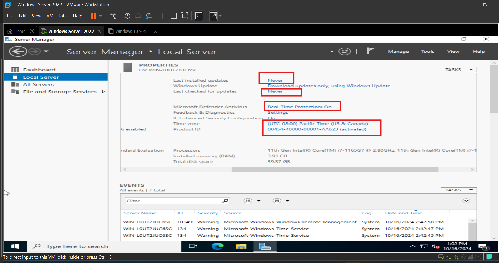
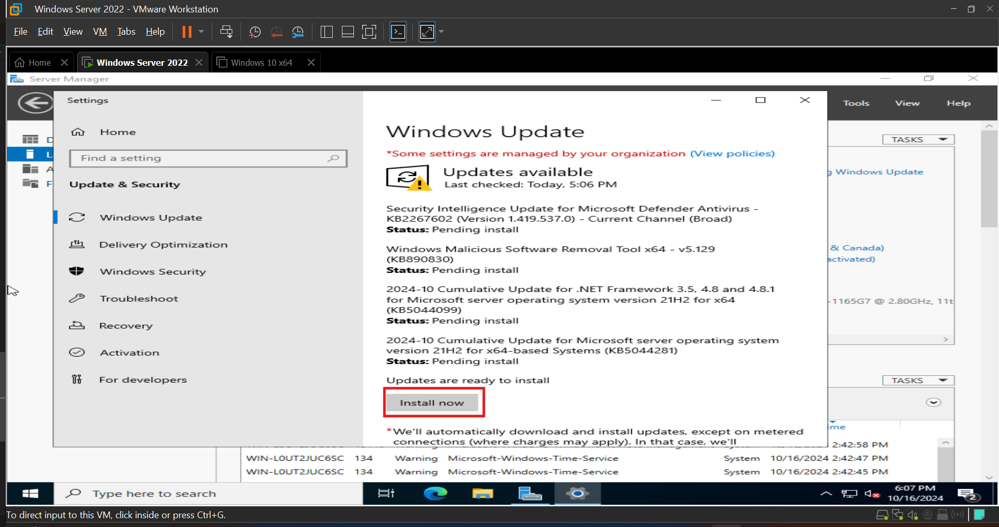

# Windows Server Pre-Configuration for Active Directory Installation

## Introduction  

Now that we have our Windows Server 2022 installed, We will configure some essential settings. check [Setup Instructions](./Documentation/Setup_Instructions.md) file. 

 Before installing Active Directory Domain Services (AD DS) on the Windows Server, it’s important to configure essential settings to ensure a stable and secure environment. In this section, we will set a static IP address, perform Windows updates, and temporarily disable the firewall to avoid any installation conflicts. These steps will prepare the server for its role as a Domain Controller in the upcoming phases.

## Step 1: Checking our Local Server Settings:

- Open Server Manager → Local Server.  

Our server has a default name. Firewall is on. Remote Desktop is disabled. IPv4 address assigned by DHCP, and IPv6 is enabled. Server was never updated. Microsoft Defender Antivirus is on and Time Zone is set to  Pacific_Time.

## Step 2: Configure Static IP Address  

### VM Network Configuration

I haven't talked about how I configured the VM network on the previous phase, so I will talk about that here.
My host computer is using Class C private IP (192.168.x.x). to be exact my host default gateway is 192.168.1.1.  
VMware automatically uses VMnet1 and VMnet8 adapters but you can configure more if you want. Let’s break down what VMnet1 and VMnet8 do in VMware networking:  

- VMnet1 (Host-only network):

This creates a private network between the host machine (your physical computer) and your virtual machines (VMs). VMs can communicate with each other and the host, but cannot access the internet or external networks. VMware assigns a private IP range to this adapter (e.g., 192.168.x.x).  

- VMnet8 (NAT network):

VMs connected to VMnet8 can access the internet through the host’s network connection. The NAT (Network Address Translation) allows VMs to share the host’s IP for external communication while using private IPs.  

#### Quick Summary:  

- VMnet1: Private communication between host and VMs (no internet access).  
- VMnet8: VMs access the internet via the host’s connection using NAT.  

Now that we have an understanding of how VMware network works lets set it up.

1. Click on Edit on the VMware -> Virtual Network Editor.  

2. We see that our :

	- VMnet1 has a subnet address of 192.168.67.0  
	- VMnet8 has a subnet address of 192.168.66.0  

3. We are interested in VMnet8 since we chose NAT network connection for our server VM when we created it. Click on Change Settings at the bottom right corner.  
4. Select VMnet8 and click on NAT Settings.  

5. Note your VMnet8 gateway IP address: 192.168.66.2 and click OK.  

6. Click on DHCP Settings.  

7. You can see starting and ending IP addresses for your DHCP setting. I changed my starting IP address to 192.168.66.99 so I can you 192.168.66.100 as a static IP for my Server. Click OK.  

8. Click OK to apply the settings then that window will close.  

Now that we have our VM machine network configured lets move to our Windows server IP Configuration.

### Configure Windows Server Static IP address.

1. Open Server Manager → Local Server.  
2. Click the IPv4 address link next to Ethernet.  
3. In Network Connections, right-click the Ethernet adapter → Properties.  
4. Double Click on  Internet Protocol Version 4 (TCP/IPv4).    

5. Set the IP manually (Static IP):  
   IP Address: 192.168.66.100  
   Subnet Mask: 255.255.255.0  
   Default gateway: 192.168.66.2  
   Preferred DNS: 127.0.0.1 (check explanation below)  
   Alternate DNS server: 8.8.8.8 (Google DNS)  

   Click Ok and close the next window.  

#### Why Use Loopback IP (127.0.0.1) for DNS: 

I use the loopback IP (127.0.0.1) as the primary DNS on the Domain Controller to ensure that the server resolves its own DNS queries locally, even if the network connection is down. This enhances reliability and guarantees that the Domain Controller can always access its own DNS services for Active Directory operations.

6. Now We check our ip configuration on Cmd and ping to test connectivity. 
  6.1. type cmd on search bar.  
  6.2. open cmd.  
  6.3. type ipconfig /all and press enter  

  6.4. We can see now that ou static IP configuration applied  
  6.5. type ping google.com to check connectivity to public internet 

  

  pinging to google was successful therefore We have successfully completed our Static Ip configuration.  

## Step 3: Verifying and adjusting our Server clock.

1. Open Server Manager → Local Server.  
2. Scroll to the right and click Time Zone.  

3. Make sure you time zone, date and time are correct, if not change it to your current time and Time Zone.

## Step 4: Update Windows Server

1. Go to Settings → Update & Security → Windows Update. | or  Open Server Manager → Local Server →Scroll to the right and click on Last installed Updates.  
2. Click Check for updates → Install any available updates.  It will take a minute to download updates.  

3. Restart the server if needed.  
4. Once server is rebooted and updates are installed. We go back and check if there are any more updates.  

## Step 3: Disable Windows Firewall Temporarily

### Disabling the Firewall During AD Installation:  

During Active Directory (AD) installation, certain ports and services need to be open for the installation to complete successfully, particularly for DNS and domain controller functions. Disabling the firewall temporarily ensures no conflicts arise. However, this should be considered secure as long as the server is in a controlled environment. After installation, it's critical to re-enable and properly configure the firewall to allow only the necessary ports for AD operations while blocking others for security.

1. Open Windows Defender Firewall | or Server Manager  → Local Server  → Click on Microsoft Defender Firewall → Turn Windows Defender Firewall on or off.  
2. Disable for Domain, Private networks.  

## Next Step:

After completing these tasks, proceed with Active Directory Domain Services (AD DS) installation as outlined in the next phase.