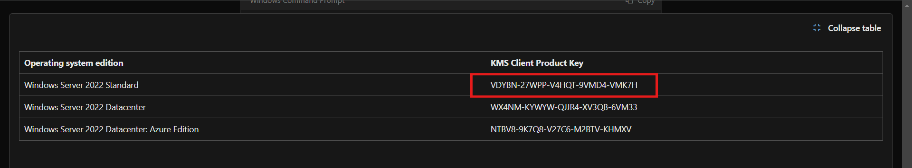

## Phase 1: Virtual Environment Setup

### Step 1: Install VMware Workstation Pro
1. Visit the [VMware's website](https://www.vmware.com/products/desktop-hypervisor/workstation-and-fusion). 
2. Download and install VMware Workstation Pro. You will be asked to create an account. Once you do, download VMware WorkStation Pro.
3. When installing choose "for personal use" option to get free license.

4. It would be a good idea to organize vm's and virtual drives on separate folders.

## Step 2: Creating the windows server Virtual Machine 

1. Download ISO file of windows server 2022 and windows 10 or 11 from [Microsoft's Website](https://www.microsoft.com/en-us/evalcenter)

2. You can use below Microsoft Generic keys to activate the windows.

3. Open **VMware Workstation** and click **Create a New Virtual Machine**.
4. Select **Custom (Advanced)** for the configuration type. Click next twice.
5. Browse to the path where you save the windows server ISO file downloaded and click next.

6. input the Windows Product Key, choose the version of Windows Server to Install. "versions with core don't have GUI, but just command line. I will do this same project later with windows core version only." Click next.

7. Name your Windows Server VM and choose a directory path and click next.

8- Check UEFI and Secure Boot and then click next. 
9- chose how many processors and cores you want to assign your VM. (depends of what kind of processor you are running). Click Next. 
10- Specify how much RAM you want for your VM. Click Next. 
11- choose which network connection you want. I chose NAT so the VMs share the host machine’s IP address to access external networks. Click Next 3 times. 
12- Create new virtual disk. click Next. 
13- Specify your VM disk capacity. Click Next. 
14- choose a path where you want your virtual disk stored. Click Next. 
15- If you want to change anything or add/remove hardware, click Customize Hardware, otherwise click finish. 

### Step 2. Installing Windows Server

After setting up the VM from first step, The VM will boot to Microsoft windows installation Page.

1- Follow through the process. The ISO file I am using has 4 versions of Windows server 2022, I am choosing the standard version with Desktop experience.

2- Follow through the steps.

3- Once done, The system will reboot, and asks you to set admin password. Type in your Strong Password and click Finish.

4- The system will apply settings, and get you to Log on Screen. Type in Your password and log in.

5- Windows server will load, and opens up on Server Manager Automatically. That will conclude our Windows Server Installation.

### Step 3: Installing Windows Clients

Process of installing Windows Client is similar to Installing Windows Server.

1- Create VM for Windows 10 or Windows 11 client. Same as we did on Windows Server.

2- Install Windows 10

3- Follow through the steps. I am installing Windows 10 Pro.

4- You will be asked to log in using Microsoft Account, I choose a local account. 
5- Follow the steps, choose a computer name, set up password. The windows will apply settings and load up.

This concludes our Windows 10 Client Installation on VMware VM.

### Next Steps

With the virtual environment now set up and the operating systems installed on your VMs, the next phase of the project is to configure Windows Server as a Domain Controller by installing and setting up Active Directory Domain Services (AD DS). In this phase, you’ll create a domain, manage users and organizational units (OUs), and begin configuring Group Policies to manage and secure your network. Ensure that your VMs are fully operational before proceeding to this critical step.

