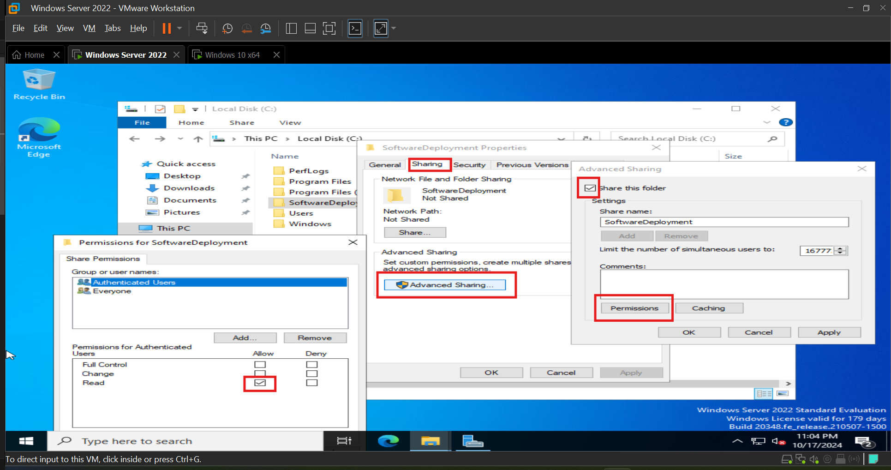

## Phase 5: Deploying Software via Group Policy  

In the previous phase, we organized the Active Directory environment by creating Organizational Units (OUs), adding user accounts, and enforcing Group Policies for security settings. With that foundational structure in place, this phase focuses on software deployment using Group Policy. By configuring Group Policy to deploy software automatically to client machines, we streamline application management across the network, ensuring consistent and efficient installations.  

### Software to Deploy  

- **7-Zip** (file archiver). Download the msi file from here [7Zip](https://shorturl.at/An8TJ).  
- **Google Chrome** (web browser). Download the msi file from here [Google Chrome](https://shorturl.at/jlpoM).  

### Step 1: Setting up the Shared Folder  

1. Create a folder named 'SoftwareDeployment' on the Domain Controller ('C:\SoftwareDeployment').  

2. Place the **MSI files** ('7zip.msi', 'GoogleChrome.msi') inside.  

  

3. Share the folder:  

   - Right-click the folder → **Properties** → **Sharing** → **Advanced Sharing** → **Share this folder**.  
   - Set **Read** permissions for **Authenticated Users**. Click OK twice then Close.  
     

   - path: '\\DC1\SoftwareDeployment'.  

     

### Step 2: Create the GPO for Software Deployment  

1. Confirm you can navigate to the shared folder created from the client  computer.  ('\\DC1\SoftwareDeployment').  

2. Open **Group Policy Management**.  

3. Right-click the domain (tekfix.com) or specific OU → **Create a GPO** → Name it **Software Deployment**.  

### Step 3: Configure the GPO  

1. Right-click **Software Deployment GPO** → **Edit**.  

  

2. Navigate to **Computer Configuration** → **Policies** → **Software Settings** → **Software Installation**.  

3. Right-click **Software Installation** → **New** → **Package**.  

  

4. Enter the path to the MSI file ('\\DC1\SoftwareDeployment\7zip.msi'), and select **Assigned**.  

5. Repeat for **Google Chrome** ('\\DC1\SoftwareDeployment\GoogleChrome.msi').  Close the window.  

  

### Step 4: Test the Deployment  

Usually when the client computer restarts, the GPO will be applied and the software will be installed. 
You could also right-click on the OU and click on the group policy update. It usually takes sometime and 
then updates the gpo on the client machine. Or you can just use the below testing for the purpose of this project.  

  

1. On one of the client machines, restart the computer (or run gpupdate /force in Command Prompt).  

2. After reboot, check if the software has been installed automatically.  

  

  

### Summary  

In this phase, we successfully deployed software via Group Policy to domain computers. We created a shared folder 

on the domain controller, set appropriate permissions, and used GPO to assign software installation.

With the deployment working as expected, we confirmed that both Chrome and 7-Zip were successfully installed.  

Next, we'll move on to configuring security policies for each department (IT, HR, Sales) to enhance system security 

and role-based access control.  

Click on [Department-Specific Security Policies Implementation](./Department-Specific_Security_Policies_Implementation.md) to move to next phase.  